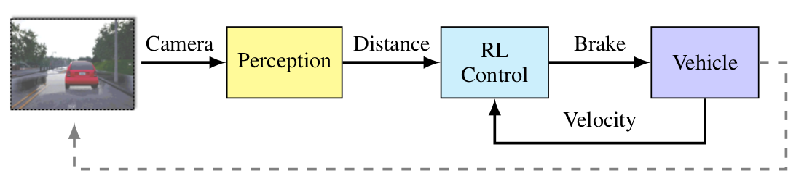
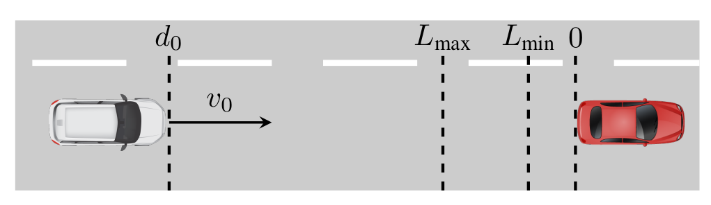

# Introduction

This repository provides the implementation of an Advanced Emergency Braking System (AEBS) in Carla. We use this AEBS implementation to
test the results of the paper "Real time Out of distribution detection in Learning-Enabled Cyber Physical Systems" by Feiyang Cai published in ICCPS'20. This code can be best utilized keeping in
mind the following architecture for the AEBS system:



The output from the camera sensor can be used to estimate the distance
from the leading car as shown in the architecture. This computed
distance can then be input to a learned controller (using the DDPG)
algorithm which outputs an appropriate braking signal to control the vehicle velocity.

The scenario that we have implemented in this repo is shown below:
We have two actors in the scene (two cars shown in white and red).
The car in red is stationary in the scene while the car in white accelerates towards the red car. The objective is that the white car
must satisfy the following bounded liveness property:



**The white car must stop at a distance of 1-3m from the red car.**

# Dependency setup

To setup install pipenv using `pip install pipenv` and run the command
`pipenv install` to setup all the dependencies :)

# Running the code:

## Collecting data from the simulator
To collect the data from the simulator using the command (in GUI mode):
```
python collect.py --collect-path /path/where/to/store/images --num-episodes 80 --mode in --gui
```
To collect the data in a non-gui mode remove the --gui flag

## Training the Perception LEC

To train the Perception LEC on the data collected above use the command:

```
python train_perception.py /path/to/collected/data/ /checkpoint/save/path \
                    --batch-size 64\
                    --random-state 0\
                    --lr 0.01\
                    --optim SGD\
                    --epochs 100
```

## Training the VAE

To train the VAE on the generated data use the command:

```
python train_vae.py train-vae /path/to/collected/data/ /checkpoint/save/path \
                    --batch-size 64\
                    --random-state 0\
                    --code-size 1024\
                    --lr 0.01\
                    --optim SGD\
                    --epochs 100
```

## Training the RL agent
To train the RL agent using the DDPG algorithm, use the following command (With a GUI. To not use the gui remove the --gui flag):
```
python aebs.py --save-path /rlagent/chkpt/save/path/ \
                                --num-episodes 1000 \
                                --agent-chkpt-path /chkpt/to/load
                                /paths/from \
                                --gui
```

## Precomputing the calibration scores using the VAE NCM
To compute the calibration scores and save run the method `compute_calibration_scores`
provided in utils/util.py. Running this method would generate a numpy file
at the `save_path` provided to this method!. This can then be used to
run the AEBS scenario in an end-to-end fashion


## Running the Complete AEBS scenario
To train the RL agent using the DDPG algorithm, use the following command (With a GUI. To not use the gui remove the --gui flag):
```
python aebs.py --save-path /rlagent/chkpt/save/path/ \
                                --num-episodes 1 \
                                --agent-chkpt-path /path/to/load/rlagent/chkpt/ \
                                --perception-chkpt-path /path/to/trained/perception/chkpt \
                                --vae-chkpt-path /path/to/trained/vae/path/ \
                                --calibration-scores /path/to/precomputed/calibration/scores \
                                --gui --testing --generate-plots
```

 ## Author
 Kushagra Pandey
 @kpandey008
